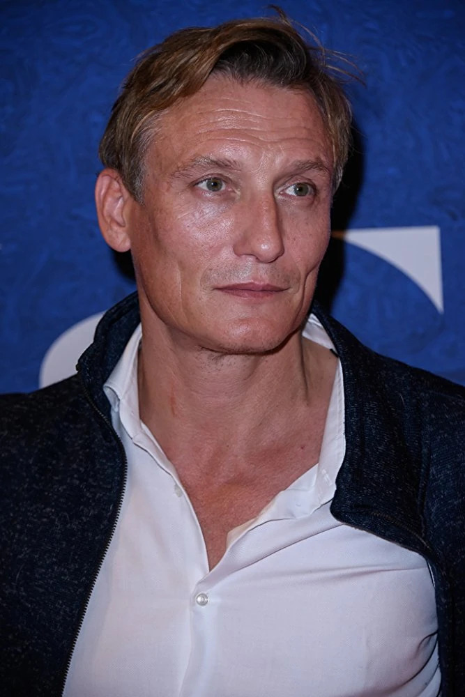

# Fundamentals of Computer Vision and Machine Learning Project

|                   Test Image                   |                      1st Match                      | 1st Score |                      2nd Match                      | 2nd Score |                      3rd Match                      | 3rd Score |
|:----------------------------------------------:|:---------------------------------------------------:|:---------:|:---------------------------------------------------:|:---------:|:---------------------------------------------------:|:---------:|
|  |  |  82.35%   |  |  77.27%   |  |  77.21%   |
|  |  |  87.16%   |  |  83.50%   |  |  80.71%   |
|  |  |  83.57%   |  |  79.08%   |  |  70.79%   |
|  |  |  82.94%   |  |  72.32%   |  |  69.57%   |
|  |  |  80.21%   |  |  78.13%   |  |  76.58%   |
|  |  |  88.22%   |  |  77.41%   |  |  76.25%   |
|  |  |  85.39%   |  |  81.64%   |  |  80.27%   |
|  |  |  84.37%   |  |  81.35%   |  |  77.30%   |
|  |  |  82.51%   |  |  71.46%   |  |  68.09%   |
|  |  |  85.97%   |  |  80.45%   |  |  79.02%   |
|  |  |  91.67%   |  |  85.11%   |  |  81.73%   |
|  |  |  86.33%   |  |  85.53%   |  |  84.36%   |
|  |  |  82.85%   |  |  81.44%   |  |  79.24%   |
|  |  |  79.23%   |  |  78.15%   |  |  76.25%   |
|  |  |  89.40%   |  |  88.84%   |  |  82.53%   |