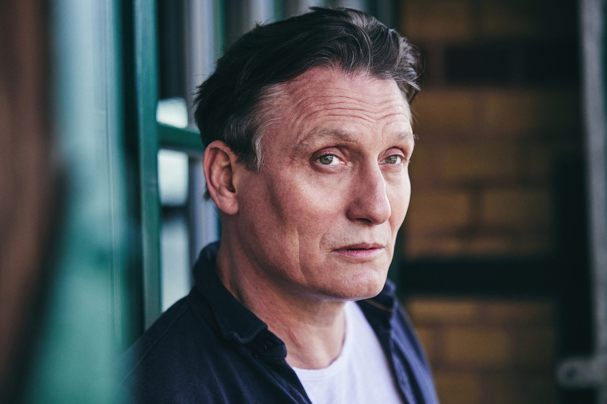

# Fundamentals of Computer Vision and Machine Learning Project

## FaceNet

|                   Test Image                   |                      1st Match                      | 1st Score |                      2nd Match                      | 2nd Score |                      3rd Match                      | 3rd Score |
|:----------------------------------------------:|:---------------------------------------------------:|:---------:|:---------------------------------------------------:|:---------:|:---------------------------------------------------:|:---------:|
|  |  |   0.824   |  |   0.773   |  |   0.772   |
|  |  |   0.872   |  |   0.835   |  |   0.807   |
|  |  |   0.836   |  |   0.791   |  |   0.708   |
|  |  |   0.829   |  |   0.723   |  |   0.696   |
|  |  |   0.802   |  |   0.781   |  |   0.766   |
|  |  |   0.882   |  |   0.774   |  |   0.762   |
|  |  |   0.854   |  |   0.816   |  |   0.803   |
|  |  |   0.844   |  |   0.814   |  |   0.773   |
|  |  |   0.825   |  |   0.715   |  |   0.681   |
|  |  |   0.860   |  |   0.805   |  |   0.790   |
|  |  |   0.917   |  |   0.851   |  |   0.817   |
|  |  |   0.863   |  |   0.855   |  |   0.844   |
|  |  |   0.829   |  |   0.814   |  |   0.792   |
|  |  |   0.792   |  |   0.781   |  |   0.762   |
|  |  |   0.894   |  |   0.888   |  |   0.825   |

## MobileNet-V3-Large

|                   Test Image                   |                      1st Match                      | 1st Score |                      2nd Match                      | 2nd Score |                      3rd Match                      | 3rd Score |
|:----------------------------------------------:|:---------------------------------------------------:|:---------:|:---------------------------------------------------:|:---------:|:---------------------------------------------------:|:---------:|
|  |  |   0.795   |  |   0.790   |  |   0.783   |
|  |  |   0.772   |  |   0.765   |  |   0.762   |
|  |  |   0.820   |  |   0.792   |  |   0.776   |
|  |  |   0.600   |  |   0.587   |  |   0.585   |
|  |  |   0.638   |  |   0.613   |  |   0.528   |
|  |  |   0.759   |  |   0.622   |  |   0.620   |
|  |  |   0.818   |  |   0.725   |  |   0.638   |
|  |  |   0.709   |  |   0.709   |  |   0.674   |
|  |  |   0.685   |  |   0.668   |  |   0.600   |
|  |  |   0.816   |  |   0.789   |  |   0.783   |
|  |  |   0.826   |  |   0.826   |  |   0.808   |
|  |  |   0.767   |  |   0.765   |  |   0.723   |
|  |  |   0.887   |  |   0.828   |  |   0.820   |
|  |  |   0.812   |  |   0.809   |  |   0.772   |
|  |  |   0.709   |  |   0.707   |  |   0.646   |

## MobileNet-V3-Small

|                   Test Image                   |                      1st Match                      | 1st Score |                      2nd Match                      | 2nd Score |                      3rd Match                      | 3rd Score |
|:----------------------------------------------:|:---------------------------------------------------:|:---------:|:---------------------------------------------------:|:---------:|:---------------------------------------------------:|:---------:|
|  |  |   0.812   |  |   0.784   |  |   0.774   |
|  |  |   0.782   |  |   0.736   |  |   0.695   |
|  |  |   0.872   |  |   0.807   |  |   0.776   |
|  |  |   0.654   |  |   0.645   |  |   0.638   |
|  |  |   0.683   |  |   0.651   |  |   0.574   |
|  |  |   0.782   |  |   0.774   |  |   0.607   |
|  |  |   0.786   |  |   0.721   |  |   0.680   |
|  |  |   0.720   |  |   0.714   |  |   0.692   |
|  |  |   0.663   |  |   0.661   |  |   0.657   |
|  |  |   0.816   |  |   0.802   |  |   0.794   |
|  |  |   0.834   |  |   0.820   |  |   0.819   |
|  |  |   0.744   |  |   0.722   |  |   0.714   |
|  |  |   0.790   |  |   0.779   |  |   0.778   |
|  |  |   0.752   |  |   0.717   |  |   0.679   |
|  |  |   0.770   |  |   0.763   |  |   0.758   |